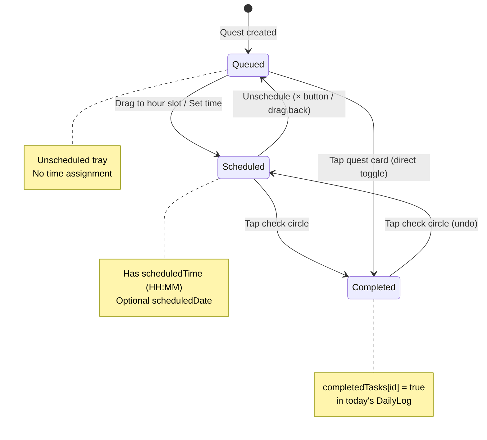

# PROJECT ASCEND — INTERACTION SPECIFICATION

**Interaction Invariants & Cross-Platform Adaptation**  
**Version:** 1.0 | **Date:** 2026-06-13  
**Author:** Senior Cross-Platform UX Architect

---

## 0. Document Purpose

This document defines **WHAT stays the same** across Desktop and Mobile (Interaction Invariants) and **WHERE each platform breaks** (Friction Points). It is the single source of truth for every interaction in Project Ascend.

**Guiding Principle:** The *rules of the game* are identical on every screen. Only the *physical means of interaction* differ.

---

##  1. INTERACTION INVARIANTS (Cross-Platform Rules)

---

### 1.1 PILLAR SWITCHING — The Selector Invariant

**Rule:** The user MUST always switch between pillars via a labelled selector component that shows ALL active pillar icons + labels simultaneously. No hidden swipe gestures, no gesture-only discovery.

#### Invariant Specification

| Property | Value |
|----------|-------|
| **Trigger** | Tap/click on a pillar tab |
| **Feedback** | Active tab: filled brand color background + border glow. Inactive: muted text. Motion: 150ms color crossfade. |
| **Accessibility** | Each tab is a `<button>` with `aria-label="Switch to {pillarLabel}"`. Active tab has `aria-current="true"`. |
| **Keyboard** | Arrow keys move focus between tabs. Enter/Space selects. Tab order: left→right, top→bottom. |
| **Min touch target** | 44×44 CSS pixels (WCAG 2.1). |
| **Visual state** | Pillar icon (16-20px) + label text (11-13px) + optional badge (streak count). |

#### Where it appears in code

| Component | Selector Type | Line Ref |
|-----------|--------------|----------|
| `Dashboard.tsx` | Horizontal filter tabs (all / health / mental / productivity) | `activeFilter` state |
| `PillarTracker.tsx` | Vertical tab list with pillar icons | `activePillar` state, `pillarIds` map |
| `OnboardingScreen.tsx` | 2-column checkbox grid (max 3 selectable) | Step 1 "pillars" |

#### Platform Implementation

```
DESKTOP (>1024px):
┌──────────────────────────────────────────────────┐
│  [  All  ] [  Health  ] [Mental] [Productivity] │
│   active    inactive    inactive   inactive      │
└──────────────────────────────────────────────────┘
  - Horizontal scroll NOT needed (fit up to 9 pillars at 120px each = 1080px)
  - Hover: bg-lighten on inactive tabs
  - Click: instant switch

MOBILE (<768px):
┌──────────────────────────────────────┐
│ [All] [Health] [Mental] [Prod] [→]  │ ← horizontally scrollable
└──────────────────────────────────────┘
  - Horizontally scrollable chip row with fade-edges
  - Swipe-left scrolls tabs; tap selects (NOT swipe-to-select)
  - Active tab auto-scrolls into view on selection
  - Sticky at top of viewport (iOS Safari safe-area aware)
```

---

### 1.2 QUEST STATE MACHINE — Queued → Scheduled → Completed

**Rule:** Every quest follows exactly 3 lifecycle states. The transition mechanics are deterministic and identical on all platforms.

#### State Machine Diagram



#### Invariant Specification

| Transition | Trigger | Validation | Feedback |
|------------|---------|------------|----------|
| **Queued → Scheduled** | Drag quest onto hour slot (or manual time input) | Hour must be valid 00:00–23:00 | Quest appears in slot with check circle + time label |
| **Scheduled → Queued** | Tap × on scheduled block, or drag back to tray | — | Quest returns to unscheduled tray |
| **Scheduled → Completed** | Tap check circle | `canComplete` must be true (today's date or recurring) | Check fills green; quest text strike-through; XP burst animation; haptic("success") |
| **Completed → Scheduled** | Tap check circle again (undo) | — | Check empties; XP deducted; haptic("tap") |
| **Queued → Completed** | Tap quest card directly | Quest must be actionable (daily / isCoreHabit) | Same as Scheduled→Completed |

#### Platform Implementation

```
DESKTOP:
  Drag source:     quest chip in tray (cursor: grab → grabbing)
  Drop target:     hour slot (highlight: blue ring on hover)
  Undo:            click check circle again
  Hover on quest:  show Edit / Delete buttons

MOBILE:
  Drag source:     long-press 300ms to initiate drag (dnd-kit activationConstraint: distance: 8)
  Drop target:     hour slot (highlight: blue ring when dragging over)
  Undo:            tap check circle again
  Hover on quest:  NO HOVER — Edit/Delete ALWAYS visible as icon buttons
                   OR: swipe-left on quest card reveals Edit/Delete (iOS pattern)
```

---

### 1.3 STREAK & FREEZE MECHANICS — The Kintsugi Engine

**Rule:** Streak computation is a pure function that runs at quest-completion time, never on app load. Recovery rules are gamemode-aware. The mechanics are mathematical, not UI-dependent.

#### Invariant Specification

**Core Engine:** `registerCompletion(prev, mode, today) → { streak, freezes, seams, longestStreak, event }`

| Gamemode | Miss 1+ Days Rule | Freeze Accrual |
|----------|-------------------|----------------|
| **Drift**   | Streak never breaks — missed days are rest days. Streak extends on next completion. | No freezes (not needed) |
| **Momentum** | Spend 1 freeze if available → streak preserved. No freeze → reset to 1, record 1 gold seam. | +1 at each 7-day milestone, starts with 1, cap 2 |
| **Forge** | Spend 1 freeze if available → streak preserved. No freeze → keep 50% of streak, record 1 gold seam. | +1 at each 7-day milestone, cap 2 |
| **Ascendant** | No safety net. Missed day → reset to 1. Every comeback records 1 gold seam. | No freezes (no safety net) |

**Freeze Bank Display:**
- Always visible next to streak count as `` ️N `` where N = available freezes
- Freezes are earned at 7-day streak milestones (7, 14, 21, 28, 35, ...), cap 2
- Freeze consumption is automatic — no user action required

**Gold Seams ( ):** Counter of comebacks after breaks. Displayed in `FutureSelf` component as visible gold lines on the avatar.

#### Platform Implementation

```
DESKTOP + MOBILE: IDENTICAL
  - Streak display: `N d` with fire icon (Flame lucide icon)
  - Freeze display: ` ️N` next to streak
  - Seams display: ` N` in FutureSelf card
  - Streak event feedback:
    "extended" → haptic("streak") + system toast
    "saved"    → haptic("streak") + toast "Freeze token consumed — streak preserved"
    "recovered" → haptic("tap") + toast "Comeback recorded. A gold seam is born."
    "reset"    → haptic("tap") + toast "The Kintsugi way: break, repair, grow stronger."
```

---

### 1.4 XP WEIGHT SYSTEM — Pillar Contribution

**Rule:** Each pillar has a weight (0–100). Overall XP earned from a quest = `questXp × (pillarWeight / 100)`. Weights are user-adjustable in ±5% steps. Total weights SHOULD sum to 100% but the system tolerates any distribution (imbalance warning handles deviation).

#### Invariant Specification

| Property | Value |
|----------|-------|
| **Weight range** | 0–100 per pillar |
| **Adjustment step** | ±5% (tap − / + buttons) |
| **Default** | Evenly distributed: `floor(100 / pillarCount)` each |
| **XP formula** | `overallXpDelta = round(questXp × weight / 100)` |
| **Pillar XP** | Full quest XP always goes to the pillar (not weighted) — weight only affects OVERALL progression |
| **Display** | Percentage bar per pillar, proportional width |

#### Platform Implementation

```
DESKTOP + MOBILE: IDENTICAL
┌─────────────────────────────────────────┐
│  Health & Fitness                       │
│  ████████████████░░░░ 25%    [−] [+]   │
│  Mental Wellness                        │
│  ████████████░░░░░░░░ 20%    [−] [+]   │
│  Productivity                           │
│  ████████████████░░░░ 25%    [−] [+]   │
└─────────────────────────────────────────┘
  - −/+ buttons: 44×44px touch target each
  - Tap −: decrease by 5 (min 0)
  - Tap +: increase by 5 (max 100)
  - Feedback: bar animates width change (300ms ease-out)
  - Haptic: haptic("tap") on each adjustment
```

---

### 1.5 IMBALANCE WARNING — Detection & Resolution

**Rule:** When pillar XP distribution is too uneven, the System warns the player. The warning is always visible until resolved. Resolution is manual — the System never auto-adjusts weights.

#### Detection Formula (from `data.ts:getHarmonyMultiplier`)

```
harmonyRatio = minPillarXp / maxPillarXp

if harmonyRatio >= 0.85  →  BALANCED      (1.0× multiplier, no warning)
if harmonyRatio >= 0.50  →  SLIGHT_OFF    (0.95× multiplier, subtle indicator)
if harmonyRatio < 0.50   →  IMBALANCED    (0.85× multiplier, prominent warning)
```

#### Invariant Specification

| State | Visual | Multiplier | Message |
|-------|--------|-----------|---------|
| **Balanced** | No indicator | 1.00× | — |
| **Slight Off** | Amber dot next to Harmony label | 0.95× | "Pillars drifting apart. Small adjustments recommended." |
| **Imbalanced** | Red banner with warning icon | 0.85× | "  IMBALANCE DETECTED · Equalise your pillars to restore full XP" |

#### Resolution Flow

```
1. User sees imbalance warning in Dashboard
2. User navigates to PillarTracker
3. User adjusts weights to balance (increase low pillars, decrease dominant)
4. OR: User completes quests in neglected pillars (natural rebalance)
5. Warning clears automatically on next render when harmonyRatio ≥ 0.85
6. Multiplier returns to 1.0× immediately (no cooldown)
```

#### Platform Implementation

```
DESKTOP + MOBILE: IDENTICAL
  - Warning banner: full-width, sticky below header
  - Color: amber (#FFD60A) for slight, red (#FF453A) for imbalanced
  - Icon: AlertTriangle lucide icon
  - Dismissible: NO (persists until resolved — gamification rule)
  - Tap banner → navigates to PillarTracker tab
```

---

### 1.6 DOMAIN UNLOCK GATING — Expansion Protocol

**Rule:** Users start with 3 free pillar slots. Slots 4–6 require meeting level/streak/pillar thresholds. Ghost Protocol users are hard-capped at 3 domains.

#### Unlock Table

| Slot | Requirement | Ceremony Message |
|------|-------------|------------------|
| 1–3 | Always unlocked | — |
| 4 | Player Level ≥ 10 AND any pillar streak ≥ 14 | "The vessel has proven worthy. A fourth domain awakens." |
| 5 | Player Level ≥ 20 AND any pillar ≥ Lv.10 | "Five pillars. The forge burns brighter." |
| 6 | Player Level ≥ 35 AND any pillar streak ≥ 30 | "All six domains respond. You are the architect now." |

#### Invariant Specification

| Trigger | Action |
|---------|--------|
| Tap "Add domain" button | Check eligibility. If passed → open domain picker modal. If failed → show rejection toast with specific reason. |
| Select domain in picker | Close picker. Add pillar to profile with Level 1, XP 0, weight 10. Show unlock ceremony toast if slot ≥ 4. |
| Ghost Protocol cap | Hard reject: "Domain expansion requires a permanent identity. Sync your progress." |
| Gold pulse | Newly unlocked domain card gets gold border pulse animation for 2 seconds. |

#### Platform Implementation

```
DESKTOP:
  "Add domain" button: positioned in Pillar Attributes header
  Domain picker: centered modal with 2-column grid of available pillars
  Rejection toast: bottom-center, auto-dismiss 3.5s

MOBILE:
  "Add domain" button: same position, full-width
  Domain picker: bottom sheet (not centered modal) for thumb reach
  Rejection toast: bottom (above tab bar), auto-dismiss 3.5s
  Gold pulse: same 2s animation
```

---

### 1.7 QUEST EDITOR — CRUD Operations

**Rule:** Quests can be created, edited, and deleted. The editor is a modal form with identical fields on all platforms. Deletion requires confirmation.

#### Invariant Specification

| Operation | Trigger | Validation | Feedback |
|-----------|---------|------------|----------|
| **Create** | "Add Quest" button (Quests tab) | Title required. XP ≥ 1. Pillar must be selected. | Quest appears in appropriate section. Toast: "Quest created." |
| **Edit** | Edit button on quest card | Same as create | Quest updates in-place. Toast: "Quest updated." |
| **Delete** | Delete button → confirm modal → confirm | Must confirm | Quest removed. Compensatory XP deduction NOT applied (quest is definition, not completion). |

**Editor Form Fields (identical on all platforms):**
1. Title (text input, required)
2. Description (textarea, optional)
3. Pillar (select dropdown of AVAILABLE_PILLARS)
4. Type (segmented control: Daily | Weekly | Milestone)
5. XP Reward (number input, min 1, max 500, step 5)
6. Core Habit toggle (checkbox / switch)

#### Platform Implementation

```
DESKTOP:
  Editor: centered modal, max-w-md, 2-column form layout
  Pillar select: native <select> or custom dropdown
  Type: horizontal segmented control

MOBILE:
  Editor: bottom sheet OR full-screen modal (for keyboard space)
  Pillar select: native iOS/Android picker (wheel)
  Type: same segmented control
  Form: single-column, stacked vertically
  Keyboard: input fields auto-scroll into view, never hidden by keyboard
```

---

### 1.8 JOURNAL ENTRY — Daily Reflection

**Rule:** Journal has 2 sections: Morning (intention) and Evening (reflection + mood + gratitude + win). Morning is a short text input. Evening is a multi-field form. Journal save grants +8 XP once per day.

#### Invariant Specification

| Section | Fields | Save Behavior |
|---------|--------|---------------|
| **Morning Plan** | `morningIntention` (text input, "What would make today a win?") | Auto-saves on blur |
| **Evening Reflect** | `journalEntry` (textarea, min 10 chars to save), `mood` (emoji picker), `gratitude` (text), `win` (text) | Manual save button. +8 XP on first save of the day. |

#### Platform Implementation

```
DESKTOP:
  Morning: inline input in TodayHub / JournalView
  Evening: full-width textarea, mood picker as horizontal emoji row
  Voice: speech-to-text button (Web Speech API)

MOBILE:
  Morning: same inline input
  Evening: full-screen journal modal with keyboard-aware layout
  Mood: horizontal scroll chip row (emoji buttons, 44×44px each)
  Voice: prominent mic button. On-device only (Web Speech API). iOS requires HTTPS.
  Gratitude/Win: compact inputs below reflection
  Save: sticky bottom button (above keyboard when open)
```

---

### 1.9 DEEP FOCUS RAID — FocusRaid Component

**Rule:** FocusRaid is a 3-phase timer modal: Setup → Active → Cleared. During Active phase, leaving the tab or closing triggers a confirmation dialog. Completion awards XP based on duration.

#### Invariant Specification

| Phase | Duration | User Action | Feedback |
|-------|----------|-------------|----------|
| **Setup** | — | Enter objective, select duration (25/50/90m), tap "Enter the Gate" | Button pulses |
| **Active** | Selected duration | Countdown ring drains. "Retreat" button available. | Ring animates drain. haptic("levelup") on completion. |
| **Cleared** | — | Tap "Return" | Gold ring celebration. XP awarded: `duration / 5`. Stats updated. |

#### Platform Implementation

```
DESKTOP:
  Modal centered on screen. Ring visible at all times.
  Retreat: confirmation dialog (browser confirm or custom modal)

MOBILE:
  Full-screen takeover (no other UI visible).
  Ring fills viewport center.
  Retreat: custom confirmation bottom sheet.
  Keep-awake: request WakeLock API to prevent screen sleep.
  Haptic: haptic("levelup") on completion.
```

---

### 1.10 CAPTURE SHEET — Quick Add / Second Brain

**Rule:** Global capture input reachable from any tab via floating action button (mobile) or keyboard shortcut (desktop: Ctrl+K). One input, two outcomes: Add Task (parses "Gym 6pm 45m !!") or Save Note (appended to journal).

#### Invariant Specification

| Input | Outcome |
|-------|---------|
| "Add task" button | Parses natural language: time (6pm), duration (45m), priority (! / !!), creates quest |
| "Save note" button | Appends timestamped line to today's journal |
| Enter key | Triggers "Add task" |
| Escape key | Closes sheet |
| Live search (typing ≥ 2 chars) | Searches all quests + all localStorage journal entries, shows results below input |

#### Platform Implementation

```
DESKTOP:
  Trigger: Ctrl+K keyboard shortcut OR quick capture button in header
  Sheet: centered modal, max-w-lg
  Results: inline below input, scrollable

MOBILE:
  Trigger: Floating Action Button (FAB) bottom-right, 56×56px, above tab bar
  Sheet: bottom sheet, slides up from tab bar
  Input: auto-focuses on open
  Results: inline below, scrollable within sheet
  Keyboard: sheet stays above keyboard
```

---

##  2. MOBILE FRICTION POINTS (Per Invariant)

---

### 2.1 Pillar Switching — Mobile Friction

| Desktop Assumption | Mobile Friction | Severity | Mitigation |
|-------------------|-----------------|----------|------------|
| Horizontal tab bar with all labels visible | Screen width limits visible tabs to ~3-4 (at 320px, 4 tabs × 80px = 320px — no room for more) | **MEDIUM** | Horizontal scroll with fade-edge gradient overlays. Auto-scroll active tab into view. |
| Hover reveals tooltip with full pillar name | No hover on mobile | **LOW** | Always show abbreviated label. Long-press shows tooltip (title attribute). |
| Click precision on narrow tabs | Tab width < 44px violates WCAG touch target | **HIGH** | Enforce `min-width: 44px` on ALL pillar tabs. Use `gap: 8px` for separation. Current: `px-4 py-2` ≈ 32px text + 32px padding = 64px — PASSES. |
| Keyboard arrow-key navigation | No keyboard on mobile | **LOW** | Swipe-to-scroll is the mobile equivalent. Ensure `scroll-snap-type: x mandatory` for predictable scrolling. |

---

### 2.2 Quest State Machine — Mobile Friction

| Desktop Assumption | Mobile Friction | Severity | Mitigation |
|-------------------|-----------------|----------|------------|
| Drag-and-drop with precise mouse | Touch drag conflicts with page scroll. User accidentally drags when scrolling. | **CRITICAL** | `activationConstraint: { distance: 8 }` in @dnd-kit PointerSensor. Long-press (300ms) initiates drag. Scroll cancels drag. |
| Hour slots are tall enough for precise drop | At 36px min-height, hour slots are tight targets on small screens. Multiple blocks per slot compound crowding. | **HIGH** | Minimum slot height: 48px on mobile (vs 36px desktop). Max 2 blocks visible per slot; overflow shows "+N more" expander. |
| Hover reveals Edit/Delete on quest cards | No hover — users can't discover CRUD actions | **CRITICAL** | Always-visible icon buttons (Edit  , Delete  ) on every quest card. OR: swipe-left gesture reveals actions (iOS pattern). |
| Check circle is an easy click target | Check circle (20×20px rendered) is below 44×44 WCAG minimum | **HIGH** | Expand touch target to 44×44 via invisible padding (`p-3` with `w-5 h-5` icon inside). Use `touch-action: manipulation` to prevent double-tap zoom. |
| XP burst animation uses `e.clientX/Y` | `e.clientX/Y` works on touch events but coordinates may be off | **LOW** | Use `e.touches?.[0]?.clientX ?? e.clientX` for touch event compatibility. |

---

### 2.3 Streak & Freeze Mechanics — Mobile Friction

| Desktop Assumption | Mobile Friction | Severity | Mitigation |
|-------------------|-----------------|----------|------------|
| Streak display is informational only | No friction — display is identical | **NONE** | — |
| Freeze tokens are displayed as small badges | Badge text (`` ️N``) may be too small to read on low-DPI screens | **LOW** | Minimum font-size: 11px. Use `font-mono` for numeric clarity. |
| Haptic feedback enhances streak events | `navigator.vibrate()` is unreliable on iOS Safari (requires user gesture in same event loop) | **MEDIUM** | Haptic is non-critical — it enhances but never gates functionality. Fallback: silent no-op. |

---

### 2.4 XP Weight System — Mobile Friction

| Desktop Assumption | Mobile Friction | Severity | Mitigation |
|-------------------|-----------------|----------|------------|
| −/+ buttons for ±5% weight adjustment | Buttons at default size (28×28px from `h-7 w-7`) are below 44×44 WCAG minimum | **HIGH** | Increase to `h-11 w-11` (44×44px) on mobile. Use `p-2` with smaller icon inside. |
| Weight bar is a visual progress indicator | Bar rendering is CSS — identical on both | **NONE** | — |
| Total weights sum is informational | Small text below bars — readable on both | **LOW** | Use `text-[13px]` minimum on mobile. |

---

### 2.5 Imbalance Warning — Mobile Friction

| Desktop Assumption | Mobile Friction | Severity | Mitigation |
|-------------------|-----------------|----------|------------|
| Warning banner spans full content width | On narrow screens (320px), text may wrap awkwardly | **LOW** | Use `text-[11px]` with `truncate` or 2-line clamp. |
| Tap banner → navigate to PillarTracker | Easy tap target on desktop | **MEDIUM** | Ensure entire banner is tappable (`role="button"`, `tabIndex={0}`, minimum 44px height). Add chevron-right icon to indicate tappability. |

---

### 2.6 Domain Unlock Gating — Mobile Friction

| Desktop Assumption | Mobile Friction | Severity | Mitigation |
|-------------------|-----------------|----------|------------|
| Domain picker is a centered modal | Centered modals are hard to reach with thumbs on tall phones | **HIGH** | Use bottom sheet for domain picker on mobile. Thumb zone: bottom 40% of screen. |
| "Add domain" button in header | Button may be hidden behind sticky header on scroll | **MEDIUM** | Button is in Pillar Attributes section header, which stays in flow. No sticky conflict. |
| Gold pulse animation | CSS animation works identically | **NONE** | — |

---

### 2.7 Quest Editor — Mobile Friction

| Desktop Assumption | Mobile Friction | Severity | Mitigation |
|-------------------|-----------------|----------|------------|
| Pillar select as dropdown | Native `<select>` triggers iOS wheel picker (full-screen takeover) — disorienting for quick edits | **MEDIUM** | Use custom bottom sheet picker OR accept native behavior (familiar to iOS users). |
| Form fields have plenty of vertical space | Keyboard pushes form off-screen. User must scroll to see all fields. | **HIGH** | Use `position: fixed` bottom sheet that stays above keyboard. Scroll form within sheet. OR full-screen modal with `KeyboardAvoidingView`. |
| Save/Cancel buttons at bottom of modal | Buttons hidden behind keyboard | **CRITICAL** | Sticky footer with Save/Cancel always visible above keyboard. Use `VisualViewport API` to detect keyboard height. |
| Number input for XP | Number keyboard on mobile doesn't show increment/decrement arrows | **LOW** | Add stepper buttons (−/+) beside the number input. |

---

### 2.8 Journal Entry — Mobile Friction

| Desktop Assumption | Mobile Friction | Severity | Mitigation |
|-------------------|-----------------|----------|------------|
| Full keyboard for typing long reflections | Phone typing is slow and error-prone for long-form text | **HIGH** | Prominent voice-to-text button (Web Speech API). Auto-save draft to localStorage every 5 seconds. |
| Mood picker as horizontal emoji row | Emoji buttons at default size too small to tap reliably | **MEDIUM** | 44×44px minimum per emoji button. Use `text-2xl` (24px emoji). Horizontal scroll with snap. |
| Gratitude/Win as separate text inputs | Too many inputs on one screen overwhelms mobile | **MEDIUM** | Consolidate into 2 fields max. Use placeholder text as label (no separate labels). |
| Save button at bottom of form | Button hidden by keyboard | **HIGH** | Sticky save button (`position: sticky`, `bottom: 0`) with `safe-area-inset-bottom` padding. |
| Speech recognition | iOS Safari requires HTTPS + user permission. Android Chrome works. | **MEDIUM** | Graceful fallback: show mic button only when `SpeechRecognition` API is available. Show permission prompt on first use. |

---

### 2.9 Deep Focus Raid — Mobile Friction

| Desktop Assumption | Mobile Friction | Severity | Mitigation |
|-------------------|-----------------|----------|------------|
| Modal stays open while user works in other tabs | Mobile: switching apps may suspend timer (iOS background limit) | **HIGH** | Use `Web Workers` for timer (not main thread). Use `WakeLock API` to prevent screen sleep. On return, resume from persisted start time. |
| Retreat confirmation is a browser `confirm()` | `confirm()` dialogs are ugly and non-customizable on mobile | **LOW** | Use custom confirmation bottom sheet (already implemented in code as `confirmReset` state). |
| "Enter the Gate" button is easy to click | Button may be below keyboard when objective input is focused | **MEDIUM** | Dismiss keyboard on "Enter the Gate" tap. Button positioned above keyboard zone. |

---

### 2.10 Capture Sheet — Mobile Friction

| Desktop Assumption | Mobile Friction | Severity | Mitigation |
|-------------------|-----------------|----------|------------|
| Ctrl+K keyboard shortcut | No keyboard shortcut on mobile (no physical keyboard 99% of time) | **MEDIUM** | FAB (Floating Action Button) is the primary trigger. Position: bottom-right, 16px from edge, above tab bar. |
| Centered modal | Centered modal requires reaching to top of screen | **HIGH** | Bottom sheet (already implemented: `items-end` on mobile, `items-center` on desktop via `sm:items-center`). |
| Live search results inline below input | Results push action buttons down — user must scroll past results to reach Save | **MEDIUM** | Limit results to 3 tasks + 2 journal entries max. Action buttons always visible (sticky at bottom of sheet). |
| Quick text entry for task parsing | Phone keyboard is slower; natural language parsing is ideal | **NONE** | Parsing is identical. "Gym 6pm 45m !!" works on both platforms. |

---

##  3. INTERACTION DENSITY HEATMAP

```
INTERACTION              DESKTOP RISK    MOBILE RISK    OVERALL
──────────────────────────────────────────────────────────────
Quest drag-and-drop          LOW           CRITICAL          
Quest complete toggle        LOW             HIGH             
Quest editor (keyboard)      LOW           CRITICAL          
Pillar tab switching         LOW             MEDIUM           
Weight adjustment buttons    LOW             HIGH             
Journal text entry           LOW             HIGH             
Focus Raid background        LOW             HIGH             
Capture sheet trigger        LOW             MEDIUM           
Streak mechanics             NONE            NONE             
Imbalance warning            LOW             LOW              
Domain unlock gating         LOW             MEDIUM           

CRITICAL (3): Quest drag, Quest editor keyboard, Journal save button
HIGH (5): Quest toggle target, Quest CRUD visibility, Weight buttons,
           Journal voice input, Focus Raid background timer
MEDIUM (4): Pillar scrolling, Capture trigger, Domain picker, Streak haptic
LOW (3): Imbalance banner, Streak display, XP burst coordinates
NONE (2): Streak engine (pure function), Weight bar (CSS only)
```

---

##  4. CROSS-PLATFORM CONSISTENCY CHECKLIST

```
  All quest state transitions are identical on both platforms
  Streak computation is a pure function (streak.ts) — no platform divergence
  XP curve (data.ts) is a pure function — identical levels on all devices
  Rank thresholds (data.ts:RANKS) are static — identical on all devices
  Achievement definitions are generated identically
  localStorage keys are identical on both platforms
  Supabase realtime channels work identically (same JS SDK)
  Same 4 gamemodes with identical rules
  Same domain unlock thresholds
  Same harmony multiplier formula
  Haptic feedback is progressive enhancement (never gates functionality)
```

---

##  5. VIOLATIONS FOUND IN CURRENT CODE

| # | Violation | Location | Severity | Fix |
|---|-----------|----------|----------|-----|
| 1 | `streak.ts:registerCompletion` NOT wired into `App.tsx:handleToggleQuest` | `App.tsx` ~line 425 | **CRITICAL** | Replace simple `streak++` with `registerCompletion(pillarStats, gameMode, today)` |
| 2 | Check circle touch target ~20×20px (below 44×44 WCAG) | `ScheduleView.tsx` ScheduledBlock `h-5 w-5` | **HIGH** | Wrap in 44×44 container with padding |
| 3 | Weight −/+ buttons ~28×28px (below 44×44 WCAG) | `PillarTracker.tsx` `h-7 w-7` | **HIGH** | Increase to `h-11 w-11` on mobile |
| 4 | Hover-only Edit/Delete buttons on quest cards | `QuestsAchievements.tsx` | **CRITICAL** | Always-visible icon buttons on mobile |
| 5 | `e.clientX` in XP burst doesn't handle touch events | `Dashboard.tsx` handleQuestToggle | **LOW** | Use `e.touches?.[0]?.clientX ?? e.clientX` |
| 6 | No `quests` Supabase table — quests are localStorage-only | Architecture gap | **HIGH** | Create quests table per Phase 1 spec |
| 7 | `data.ts` missing exports: GAMEMODES, getGameMode, SKILL_NODES, computeAttributes, etc. | `data.ts` | **CRITICAL** | Implement missing exports |
| 8 | Journal save button not sticky on mobile | `PillarTracker.tsx` / `JournalView.tsx` | **HIGH** | Add `position: sticky; bottom: 0` with safe-area padding |
| 9 | Domain picker uses centered modal on mobile | `Dashboard.tsx` domainPickerOpen | **MEDIUM** | Use bottom sheet on mobile |
| 10 | Drag activation on mobile conflicts with scroll | `ScheduleView.tsx` PointerSensor | **HIGH** | Verify `activationConstraint: { distance: 8 }` — already set to 6, increase to 8 for mobile |

---

*End of Interaction Specification — Phase 2*
